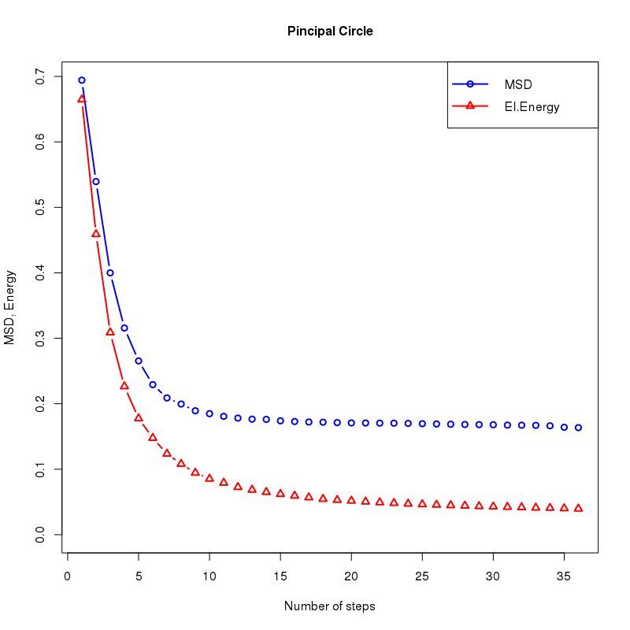
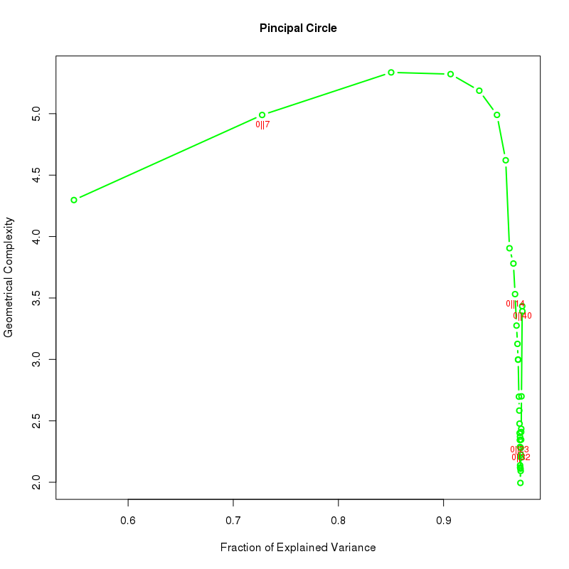
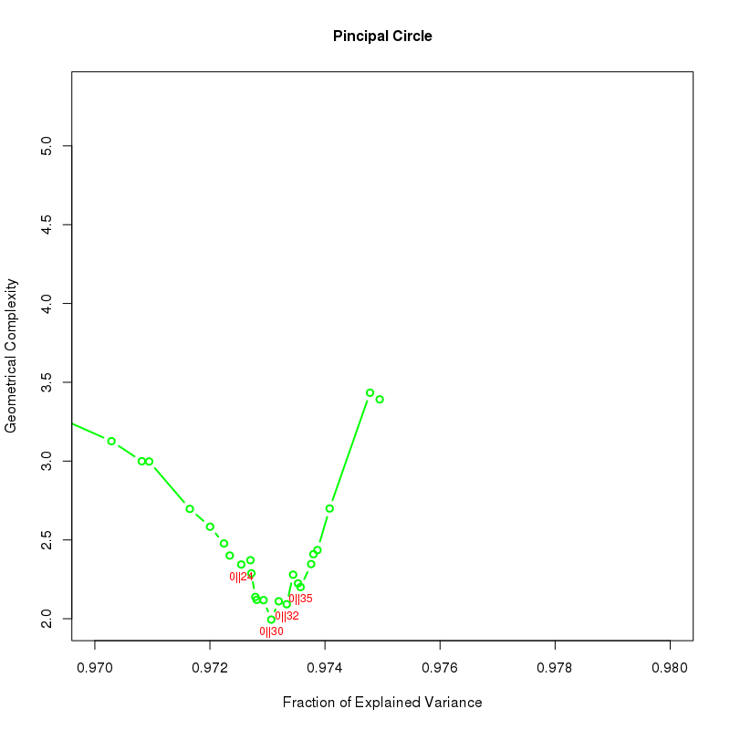
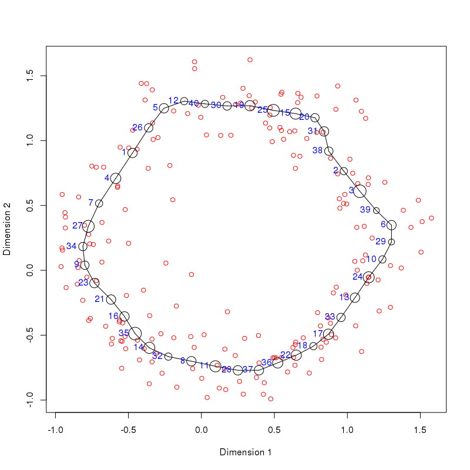
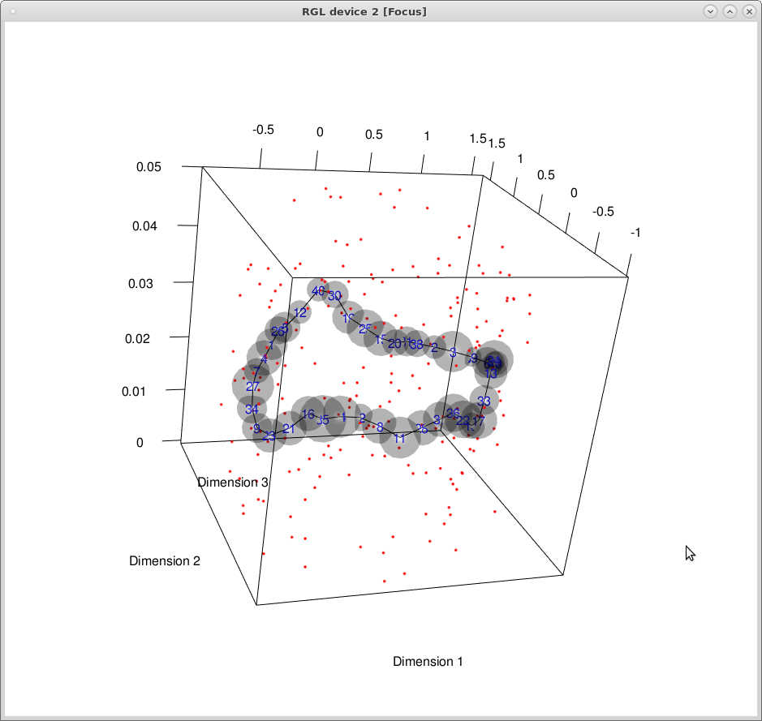

# rpgraph R package

## An essential overview of Pircipal elastic circles

[Will do later]

## rpgraph prerequisite and installation

The package is currently under development and only available on GitHub. It relises on the Java code written by Andrei Zynoviev available in the java library [VDAOEngine](https://github.com/auranic/VDAOEngine). The R code interfaces with the java library via the [`rJava` package](https://www.rforge.net/rJava/). 

A functional java virtual machine is necessary for the package to work correctly. It is advisable to install `rJava` from sources, **before** installing `rpgraph`. This can be done by typing

```{r, eval=FALSE}
install.packages(pkgs = "rJava", repos="http://rforge.net", type = 'source')
```

in the R console. Compiling from source requires the appropriate development tools, e.g., the C/C++ compiler. The installation of the package requires the `devtools` package, which is available from CRAN. The `rpgraph` package can be installed by typing

```{r, eval=FALSE}
library(devtools)
install_github("Albluca/rpgraph")
```

in the R console. To take advantage of all the feature of the package, it is advisable to also install (not necessary from source) the R packages `bigpca`, `flashpcaR`, `irlba`, `nsprcomp`, and `plotly`. `flashpcaR` is only available from GitHub and need to be installed using `devtools`:

```{r, eval=FALSE}
library(devtools)
install_github("gabraham/flashpca")
```

The other packages can be found on CRAN.

## Workaround for common problems

The installation and loading of `rJava` is known to be problematic under certain circumstances on MacOS. A number of workaround can be found on the [internet](http://conjugateprior.org/2014/12/r-java8-osx/). Possible solutions include recompiling the package, setting environment variables manually~, and changing the operating system~. Most of the times the problem is connected with the package struggling to find the appropriate information.

If `rJava` fails to load try typing

```{r, eval=FALSE}
options("java.home"="/Library/Java/JavaVirtualMachines/jdk1.7.0_79.jdk/Contents/Home/jre")
dyn.load('/Library/Java/JavaVirtualMachines/jdk1.7.0_79.jdk/Contents/Home/jre/lib/server/libjvm.dylib')
```

before loading the library. These lines may need to get adjusted depending on the version of the virtual machine that the user intend to use.

## A Few examples

The package contains a few example datasets that can be used to test its functionalities.

## Example 1 - Circle

This section describes how to produce a circular principal graph.

```{r}
library(rpgraph)
Data <- simple_circle
Results <- computeElasticPrincipalGraph(Data = Data, NumNodes = 40, Method = 'CircleConfiguration')
```

Now `Results` contain the processed principal graph. Diagnostic information can be obtained using

```{r, fig.height=5, fig.width=5}
plotMSDEnergyPlot(Results, Main = "Pincipal Circle", Cex.Main = 1)
```

to produce



and

```{r, fig.height=5, fig.width=5}
accuracyComplexityPlot(Results, Main = "Pincipal Circle", Cex.Main = 1, Mode = 5)
```

to produce




It it also possible to zoom into a specific area of the accuracy/complexity plot by using the Xlims parameter.

```{r, fig.height=5, fig.width=5}
accuracyComplexityPlot(Results, Main = "Pincipal Circle", Cex.Main = 1, Xlims = c(.97, .98))
```



Data can be plotted in 2D using the R built-in functions

```{r, fig.height=5, fig.width=5}
plotData2D(Data = simple_circle, PrintGraph = Results,
           GroupsLab = rep(1, nrow(simple_circle)), Xlab = "Dimension 1", Ylab = "Dimension 2")
```



or plotly, which produces an interactive plot. Using plotly interactivelly requires running the code in RStudio (does it?)

```{r, fig.height=5, fig.width=5}
plotData2D(Data = simple_circle, PrintGraph = Results, Plot.ly = TRUE,
           GroupsLab = rep(1, nrow(simple_circle)))
```

The result of this command can be seen [here](https://plot.ly/~Alblucac/9/dimension-2-vs-dimension-1/). The commands will produce a list of warnings. Unfortunately there is not an easy way to fix it ...

The plotly graph can be exported on the web, for example on [plot.ly](http://plot.ly) using the instruction provided [here](http://plot.ly/r/getting-started/).


Data can also be plotted in 3D using the functionalities provided by the `rgl` package


```{r, fig.height=5, fig.width=5, eval=FALSE}
plotData3D(Data = simple_circle, PrintGraph = Results, Plot.ly = FALSE,
           GroupsLab = rep(1, nrow(simple_circle)), NodeSizeMult = 0.05,
           Xlab = "Dimension 1", Ylab = "Dimension 2", Ylab = "Dimension 3")
```

which will produce an interactive 3d plot. A snapshot of this plot is displayed for reference



For `rgl` to work correctly on MacOS, a proper X11 environment need to be installed. The most common solution is the installation of [XQuartz](http://www.xquartz.org/). If the code crashes R, try using

```{r, eval=FALSE}
library("rgl")
open3d()
```

before invoking the `plotData3D` function.

It is also possible to produce 3D plots using plot.ly.

```{r, fig.height=5, fig.width=5}
plotData3D(Data = simple_circle, PrintGraph = Results, Plot.ly = TRUE,
           GroupsLab = rep(1, nrow(simple_circle)))
```

Similarly to 2D, it is possible to export the plot to a web resource.

To see how different populations distribute among the nodes of the graph by providing a population identifier to each point in the original data (The `Categories` vector). In the following example, three populations are randomly assigned.

```{r, fig.height=7, fig.width=7}
Net <- ConstructGraph(Results = Results, DirectionMat = NULL, Thr = 0.05)
TaxonList <- getTaxonMap(Results = Results, Data = Data)

InfoData <- plotPieNet(Results = Results, Data = simple_circle, NodeSizeMult = 4,
                       Categories = sample(1:3, nrow(simple_circle), replace = TRUE),
           Graph = Net, TaxonList = TaxonList, LayOut = 'circle', Main = "Pincipal Circle")
```


## Example 2 - Curve

```{r}
Data <- simple_circle

Results <- computeElasticPrincipalGraph(Data = Data, NumNodes = 20, Method = 'CurveConfiguration')

```

```{r, fig.height=5, fig.width=5}
plotData2D(Data = simple_circle, PrintGraph = Results,
           GroupsLab = rep(1, nrow(simple_circle)), Xlab = "Dimension 1", Ylab = "Dimension 2")
```


## Example 3 - tree

```{r}
Data <- simple_tree

Results <- computeElasticPrincipalGraph(Data = Data, NumNodes = 40, Method = 'DefaultPrincipalTreeConfiguration')

```

```{r, fig.height=5, fig.width=5}
plotData2D(Data = simple_tree, PrintGraph = Results,
           GroupsLab = rep(1, nrow(simple_circle)), Xlab = "Dimension 1", Ylab = "Dimension 2")
```

## References
