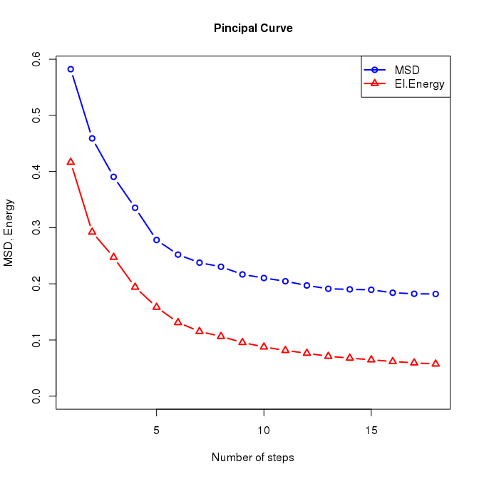
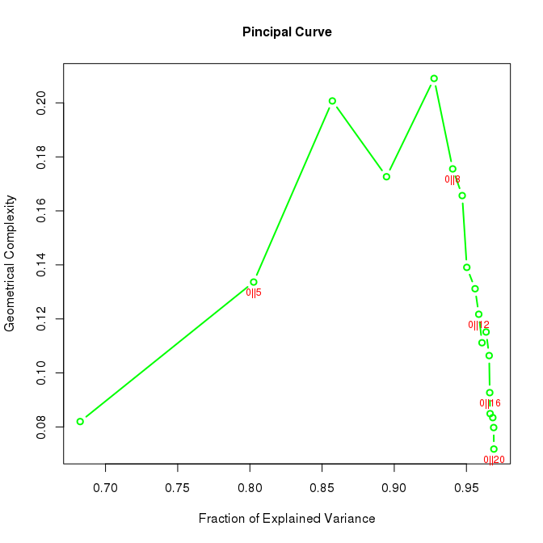
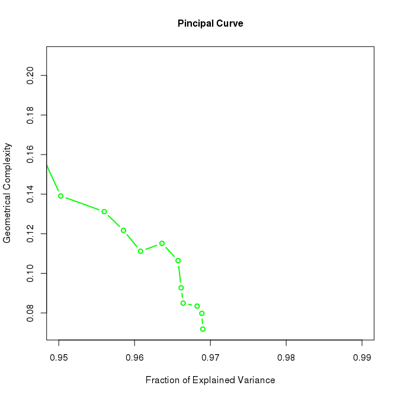
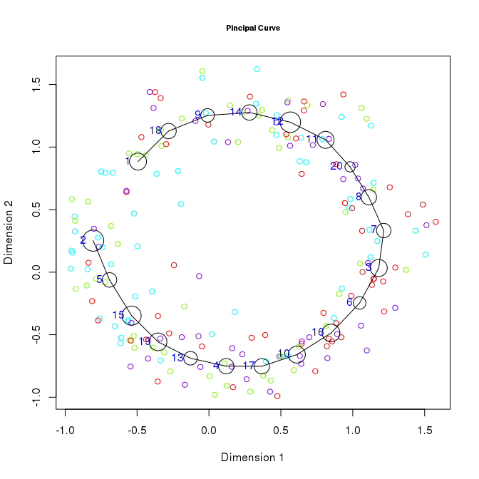
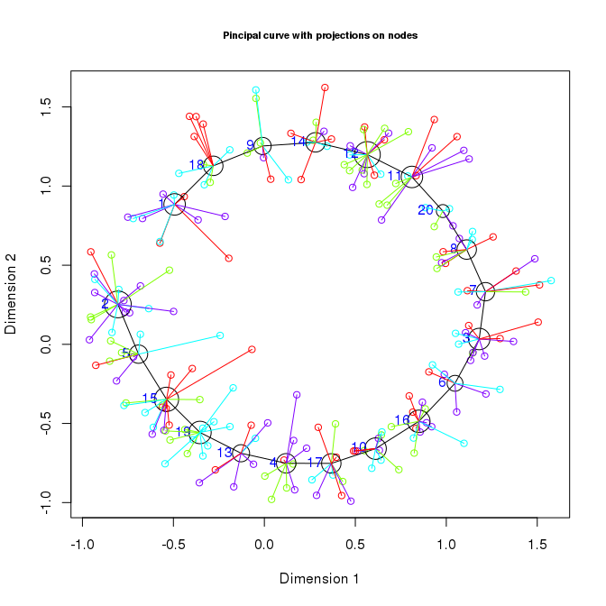
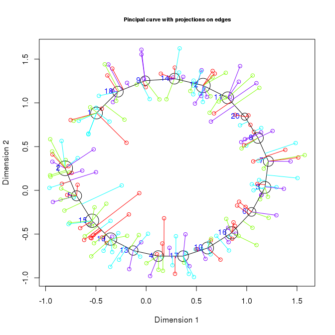
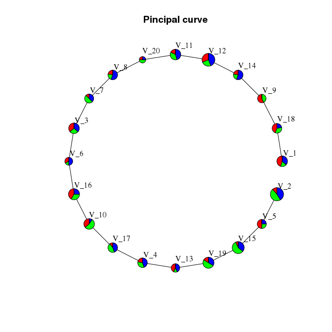

This document describes how to produce a principal curve. Note that some plots are not visible. This is due to Github not liking large html files.

Building a principal curve
--------------------------

The `simple_circle` dataset included in the package describes points placed on a three dimensional circle and we can use it to test the usage of principal curves

``` r
library(rpgraph)
```

    ## Loading required package: rJava

    ## 
    ## Attaching package: 'rpgraph'

    ## The following object is masked from 'package:base':
    ## 
    ##     Filter

``` r
Data <- simple_circle
Results <- computeElasticPrincipalGraph(Data = Data, NumNodes = 20, Method = 'CurveConfiguration')
```

    ## Configuring engine ......[1] "Empty initialization"
    ## [1] ""
    ## [1] "Running engine"

Now `Results` will be a list and the first element will contain the processed principal graph. Diagnostic information can be obtained using

``` r
plotMSDEnergyPlot(Results[[1]], Main = "Pincipal Curve", Cex.Main = 1)
```



and

``` r
accuracyComplexityPlot(Results[[1]], Main = "Pincipal Curve", Cex.Main = 1, Mode = 5)
```



It it also possible to zoom into a specific area of the accuracy/complexity plot by using the Xlims parameter.

``` r
accuracyComplexityPlot(Results[[1]], Main = "Pincipal Curve", Cex.Main = 1, Xlims = c(.95, .99))
```



Data can be plotted in 2D using the R built-in functions. Using the optional argument `Col` it is also possible to assign different colors to the different points. Note that the `GroupsLab` is a mandatory argument that associate each point to a category. It must be a facror of length equal to the number of rows of the Data matrix.

``` r
plotData2D(Data = simple_circle, PrintGraph = Results[[1]] ,
           GroupsLab = rep(1, nrow(simple_circle)), Col = rainbow(4)[sample(1:4, nrow(simple_circle), TRUE)],
           Main = "Pincipal Curve",
           Xlab = "Dimension 1", Ylab = "Dimension 2")
```



2D plots can also be done with plotly, which produces an interactive plot. Using plotly interactivelly requires running the code in RStudio (does it?)

``` r
plotData2D(Data = simple_circle, PrintGraph = Results[[1]], Plot.ly = TRUE,
           GroupsLab = factor(rep(1, nrow(simple_circle))), Xlab = "Dimension 1", Ylab = "Dimension 2")
```

This commands will produce a list of warnings, which can be ignored. Unfortunately there is not an easy way to fix it at this time.

The plotly graph can be exported on the web, for example on [plot.ly](http://plot.ly) using the instruction provided [here](http://plot.ly/r/getting-started/).

It is also possible to have the point ptojections plotted by specifying the correct value for the `PlotProjections` argument. For example it is possible to visualize projections on the nodes by setting `PlotProjections = "onNodes"`.

``` r
plotData2D(Data = simple_circle, PrintGraph = Results[[1]], PlotProjections = "onNodes",
           GroupsLab = rep(1, nrow(simple_circle)), Col = rainbow(4)[sample(1:4, nrow(simple_circle), TRUE)],
           Main = "Pincipal curve with projections on nodes",
           Xlab = "Dimension 1", Ylab = "Dimension 2")
```



    ## [1] "TaxonList will be computed. Consider do that separetedly"

and to visualize the projections on edges by typing `PlotProjections = "onEdges"`

``` r
plotData2D(Data = simple_circle, PrintGraph = Results[[1]], PlotProjections = "onEdges",
           GroupsLab = rep(1, nrow(simple_circle)), Col = rainbow(4)[sample(1:4, nrow(simple_circle), TRUE)],
           Main = "Pincipal curve with projections on edges",
           Xlab = "Dimension 1", Ylab = "Dimension 2")
```



    ## [1] "Edge Projections will be computed. Consider do that separetedly"
    ## [1] "TaxonList will be computed. Consider doing that separetedly"

Data can also be plotted in 3D using the functionalities provided by the `rgl` package

``` r
plotData3D(Data = simple_circle, PrintGraph = Results[[1]], Plot.ly = FALSE,
           GroupsLab = factor(rep(1, nrow(simple_circle))), NodeSizeMult = 0.05,
           Xlab = "Dimension 1", Ylab = "Dimension 2", Zlab = "Dimension 3")
```

The output of this command is not available on this web page due to the working of `rgl`.

For `rgl` to work correctly on MacOS, a proper X11 environment need to be installed. The most common solution is the installation of [XQuartz](http://www.xquartz.org/). If the code crashes R, try using

``` r
library("rgl")
open3d()
```

before invoking the `plotData3D` function and/or rebooting the system.

It is also possible to produce 3D plots using plot.ly.

``` r
plotData3D(Data = simple_circle, PrintGraph = Results[[1]], Plot.ly = TRUE,
           GroupsLab = factor(rep(1, nrow(simple_circle))),
           Xlab = "Dimension 1", Ylab = "Dimension 2", Zlab = "Dimension 3")
```

Similarly to 2D, it is possible to export the plot to a web resource.

To see how different populations distribute among the nodes of the graph by providing a population identifier to each point in the original data (The `Categories` factor). In the following example, three populations are randomly assigned.

``` r
Net <- ConstructGraph(Results = Results[[1]], DirectionMat = NULL, Thr = 0.05)
TaxonList <- getTaxonMap(Results = Results[[1]], Data = Data)

InfoData <- plotPieNet(Results = Results[[1]], Data = simple_circle, NodeSizeMult = 3,
                       Categories = factor(sample(1:3, nrow(simple_circle), replace = TRUE)),
           Graph = Net, TaxonList = TaxonList, LayOut = 'circle_line', Main = "Pincipal curve")
```


